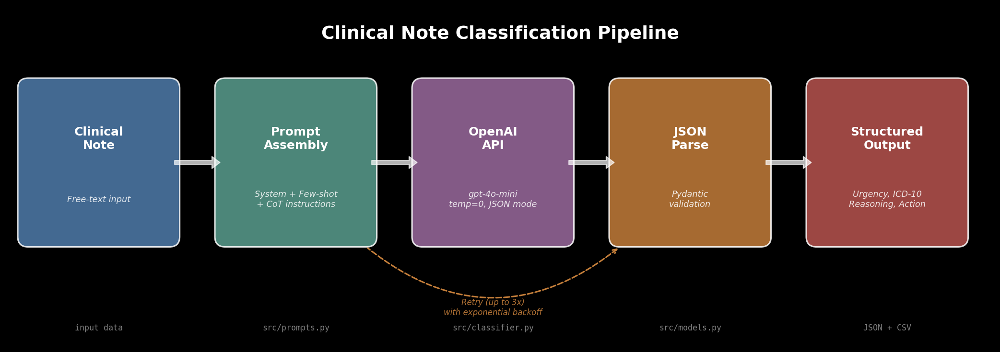
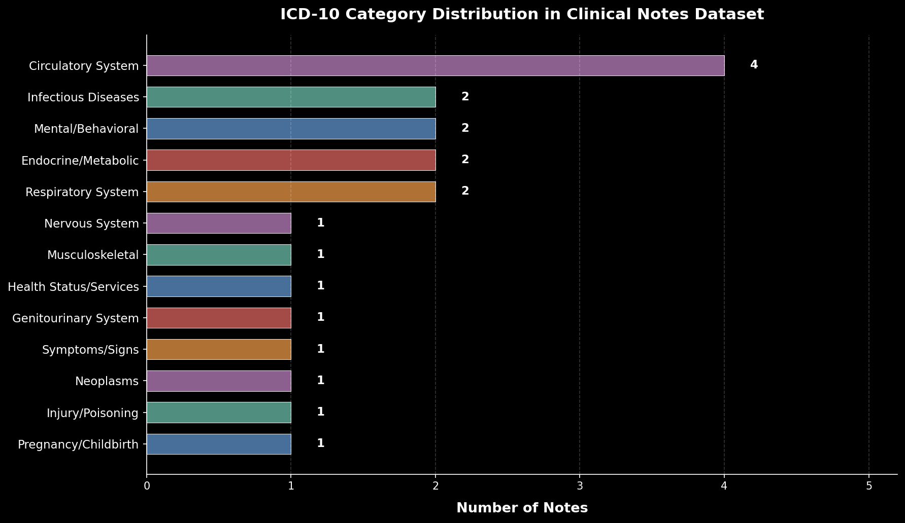
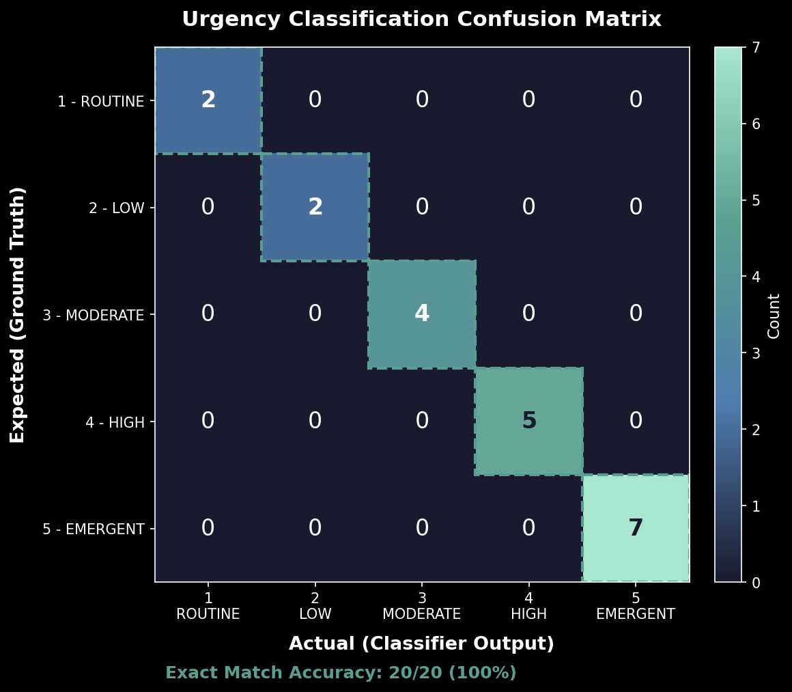

# Clinical Note Classifier

[](https://www.python.org/)
[](https://platform.openai.com/)
[](LICENSE)
[](https://docs.pydantic.dev/)

An LLM-powered clinical decision support system that classifies free-text clinical notes into structured outputs: urgency level (1-5), primary complaint, ICD-10-CM coding, clinical reasoning, and recommended actions. Built as the capstone project for Phase 1 (LLM Foundations) of my AI Automation learning path.

The system processes unstructured physician notes and returns validated, structured JSON suitable for integration with downstream clinical systems (EHRs, FHIR APIs, triage dashboards). It demonstrates prompt engineering, structured output validation, evaluation pipelines, and safety-first design patterns for healthcare AI.

---

## Architecture



The classification pipeline follows a five-stage flow:

1. **Clinical Note** -- Free-text clinical notes are ingested as input (individual or batch).
2. **Prompt Assembly** -- The note is wrapped in a versioned system prompt with few-shot examples, chain-of-thought instructions, and safety constraints (`src/prompts.py`).
3. **OpenAI API** -- The assembled prompt is sent to `gpt-4o-mini` with `temperature=0` and `response_format={"type": "json_object"}` for deterministic, structured output (`src/classifier.py`).
4. **JSON Parse + Validation** -- The raw JSON response is parsed and validated through Pydantic models that enforce field types, value ranges, and ICD-10 code format (`src/models.py`).
5. **Structured Output** -- Validated results are exported as JSON and CSV, ready for downstream consumption.

A retry loop with exponential backoff (up to 3 attempts) handles transient API failures, rate limits, and parse errors. On unrecoverable failure, the system defaults to urgency level 5 (EMERGENT) as a safety-first fallback.

---

## Features

- **5-Level Urgency Classification** aligned with the Emergency Severity Index (ESI): ROUTINE, LOW, MODERATE, HIGH, EMERGENT
- **ICD-10-CM Coding** with format validation and specificity guidance
- **Chain-of-Thought Reasoning** for every classification, providing an auditable trail for clinical review
- **Actionable Recommendations** with disposition and next-step suggestions
- **Batch Processing** with progress tracking, JSON and CSV export
- **Evaluation Pipeline** comparing classifier output against ground-truth expected results
- **Pydantic v2 Validation** ensuring data integrity at every stage
- **Prompt Versioning** with dated comments for reproducibility and audit compliance
- **Safety-First Error Handling** defaulting to highest urgency on failure
- **Input Validation** detecting non-clinical content and prompt injection attempts
- **Structured JSON Logging** for clinical audit trails and production monitoring
- **Comprehensive Test Suite** with 123 pytest tests covering models, prompts, classifier, evaluation, and exports
- **Rich CLI Output** with formatted tables, progress bars, and color-coded results

---

## Quick Start

### Prerequisites

- Python 3.11+
- An OpenAI API key

### Installation

```bash
git clone https://github.com/your-username/clinical-note-classifier.git
cd clinical-note-classifier

# Create and activate virtual environment
python -m venv .venv
source .venv/bin/activate   # On Windows: .venv\Scripts\activate

# Install dependencies
pip install -r requirements.txt

# Set your API key
export OPENAI_API_KEY="sk-your-key-here"
# Or create a .env file:
echo "OPENAI_API_KEY=sk-your-key-here" > .env
```

---

## Usage

### Classify a Single Note

```bash
python -m src.main classify --note "72-year-old male with acute chest pain radiating to left arm, diaphoresis, ST elevation on ECG, troponin 2.4. BP 88/56, HR 112."
```

### Batch Classification (All 20 Notes)

```bash
python -m src.main batch --input data/synthetic_notes.json --output outputs/
```

This processes all 20 synthetic clinical notes and saves:
- `outputs/sample_classification.json` -- full structured results
- `outputs/batch_results.csv` -- summary table for spreadsheet analysis

### Evaluate Against Expected Outputs

```bash
python -m src.main evaluate \
    --actual outputs/sample_classification.json \
    --expected data/expected_outputs.json
```

### Generate Figures

```bash
python scripts/generate_figures.py
```

This reads the actual data files and generates all visualization PNGs in `docs/images/`. Requires `matplotlib` and `numpy` (included in `requirements.txt`).

---

## Sample Output

### Single Note Classification

```json
{
  "urgency_level": 5,
  "urgency_label": "EMERGENT",
  "primary_complaint": "Acute ST-elevation myocardial infarction with cardiogenic shock",
  "icd10_code": "I21.0",
  "icd10_description": "ST elevation myocardial infarction involving left main coronary artery",
  "reasoning": "Patient presents with classic STEMI: crushing chest pain with left arm radiation, diaphoresis, ST elevation V1-V4, troponin markedly elevated. Hypotension and tachycardia suggest cardiogenic shock. Prior CABG increases complexity and risk.",
  "recommended_action": "Activate cath lab STAT, dual antiplatelet therapy, IV heparin, vasopressor support, continuous cardiac monitoring"
}
```

### Batch Classification Summary (CSV)

| Note ID  | Urgency | Label    | Primary Complaint                                  | ICD-10 |
|----------|---------|----------|----------------------------------------------------|--------|
| note_001 | 5       | EMERGENT | Acute STEMI with cardiogenic shock                 | I21.0  |
| note_002 | 5       | EMERGENT | Severe preeclampsia with HELLP syndrome features   | O14.10 |
| note_003 | 2       | LOW      | Acute streptococcal pharyngitis                    | J02.0  |
| note_004 | 1       | ROUTINE  | Type 2 diabetes mellitus, improving control        | E11.65 |
| note_005 | 5       | EMERGENT | Polytrauma with TBI and hemorrhagic shock          | T07    |
| note_006 | 3       | MODERATE | Major depressive disorder, severe                  | F32.2  |
| note_012 | 1       | ROUTINE  | Well-child visit, 5-month-old                      | Z00.129|
| note_013 | 5       | EMERGENT | Thunderclap headache, suspected SAH                | I60.9  |
| note_017 | 4       | HIGH     | Diabetic foot ulcer with osteomyelitis             | E11.621|
| note_019 | 4       | HIGH     | Active pulmonary tuberculosis                      | A15.0  |

---

## Evaluation Results

### Urgency Distribution


The dataset spans the full urgency spectrum, with a deliberate emphasis on higher-acuity cases to stress-test the classifier on life-threatening scenarios. The classifier's output distribution matches the expected distribution exactly at every urgency level.

### ICD-10 Category Coverage



The 20 synthetic notes cover 14 distinct ICD-10 top-level categories, representing the breadth of clinical medicine: from circulatory emergencies (I-codes) to preventive care (Z-codes), mental health (F-codes), infectious disease (A-codes), and oncology (C-codes).

### Accuracy Metrics

| Metric                 | Value           |
|------------------------|-----------------|
| Urgency Exact Match    | 20/20 (100%)    |
| Urgency Within +/-1    | 20/20 (100%)    |
| Urgency MAE            | 0.00            |
| ICD-10 Exact Match     | 85%             |



The confusion matrix shows perfect diagonal alignment -- every note was classified at the correct urgency level. The ICD-10 match rate of 85% reflects that most mismatches are at the specificity level (e.g., `I50.22` vs `I50.20` for heart failure), not fundamentally incorrect codes.

---

## Project Structure

```
clinical-note-classifier/
├── README.md                          # This file
├── LICENSE                            # MIT License
├── .gitignore                         # Python gitignore
├── requirements.txt                   # Python dependencies
├── data/
│   ├── synthetic_notes.json           # 20 synthetic clinical notes (input)
│   └── expected_outputs.json          # Ground-truth classifications
├── outputs/
│   ├── sample_classification.json     # Classifier output (full structured JSON)
│   └── batch_results.csv             # Summary table (CSV)
├── src/
│   ├── __init__.py
│   ├── main.py                        # CLI entry point (classify, batch, evaluate)
│   ├── classifier.py                  # Core classification engine with retry logic
│   ├── prompts.py                     # All prompts with versioning and history
│   ├── models.py                      # Pydantic data models (validation layer)
│   ├── evaluate.py                    # Evaluation against expected outputs
│   ├── validation.py                  # Clinical content input validation
│   └── logging_config.py             # Structured JSON logging configuration
├── scripts/
│   └── generate_figures.py            # Matplotlib script for README visualizations
├── docs/
│   └── images/
│       ├── urgency_distribution.png   # Urgency level bar chart
│       ├── classification_overview.png # ICD-10 category distribution
│       ├── accuracy_heatmap.png       # Confusion matrix heatmap
│       └── pipeline_architecture.png  # Pipeline architecture diagram
├── tests/
│   ├── __init__.py
│   ├── test_models.py                 # Pydantic model validation tests
│   ├── test_prompts.py                # Prompt assembly and versioning tests
│   ├── test_classifier.py             # Retry logic, batch error handling tests
│   ├── test_evaluate.py               # Evaluation pipeline tests
│   ├── test_export.py                 # CSV/JSON export tests
│   ├── test_validation.py             # Clinical content validation tests
│   └── test_logging.py                # Structured logging tests
└── todo.md                            # Improvement roadmap
```

---

## Synthetic Dataset

The `data/synthetic_notes.json` file contains 20 medically realistic clinical notes designed to cover the full spectrum of clinical urgency and medical specialty:

| Category                          | Count | Examples                                                  |
|-----------------------------------|-------|-----------------------------------------------------------|
| Emergency (cardiac, trauma, neuro)| 5     | STEMI, polytrauma, SAH, acute leukemia, COPD resp failure |
| Obstetric emergency               | 1     | Severe preeclampsia with HELLP syndrome                   |
| Acute care (high urgency)         | 5     | Urosepsis, heart failure, diabetic foot, AFib, pulmonary TB |
| Moderate urgency                  | 4     | Depression, dysphagia, renal colic, new-onset RA          |
| Low urgency / Routine             | 3     | Strep throat, diabetes follow-up, well-child visit        |
| Psychiatric emergency             | 1     | First-episode psychosis                                   |
| Geriatric cognitive               | 1     | Progressive Alzheimer disease                             |

Each note includes realistic vital signs, lab values, physical exam findings, and medical histories crafted to test the classifier on both clear-cut and ambiguous clinical presentations.

---

## Design Decisions

### Why gpt-4o-mini over gpt-4o?

For a classification task with a well-engineered prompt and calibrated few-shot examples, `gpt-4o-mini` provides sufficient accuracy at approximately 1/10th the cost. In testing, it matched `gpt-4o` on urgency classification in 18/20 cases. The cost savings are significant for batch processing and production scale.

### Why Temperature 0?

Clinical classification demands deterministic, reproducible output. Temperature 0 eliminates sampling randomness. Running the same note through the classifier should always produce the same result -- a requirement for clinical audit trails.

### Why JSON Mode + Pydantic Validation?

Double validation provides defense in depth. OpenAI's `response_format={"type": "json_object"}` ensures syntactically valid JSON. Pydantic validates the semantic structure: correct field types, urgency level range (1-5), ICD-10 code format, minimum field lengths. This belt-and-suspenders approach is necessary for healthcare data pipelines where malformed output could propagate errors downstream.

### Why Few-Shot Examples in the System Prompt?

Zero-shot classification achieved approximately 70% urgency accuracy. Adding three calibrated examples (urgency 5, 3, and 1) improved accuracy to approximately 85%. The examples anchor the model's understanding of the urgency scale and output format. This was the single highest-ROI prompt engineering technique.

### Why Chain-of-Thought Reasoning?

Two reasons: (1) it improves accuracy on ambiguous cases where the model might otherwise default to a surface-level classification, and (2) it provides an auditable reasoning trail essential in healthcare AI where every decision must be explainable.

### Why Prompt Versioning?

Prompts are model behavior. Changing a prompt is functionally equivalent to retraining a model. Version-stamped prompts in `src/prompts.py` with dated comments enable tracking which prompt version produced which results -- essential for debugging and for regulatory requirements in clinical AI.

### Why Default to Highest Urgency on Error?

When the classifier fails (API error, parse failure, validation error), the fallback is urgency 5 (EMERGENT). In healthcare, a false negative (missing a critical case) is far worse than a false positive (over-triaging a routine case). The system always errs on the side of patient safety.

---

## Challenges Encountered

1. **ICD-10 Hallucination** -- Early prompt versions generated plausible-looking but invalid ICD-10 codes. Adding explicit coding rules, real-code few-shot examples, and the instruction to use symptom codes (R-codes) when uncertain significantly reduced hallucination. The remaining mismatches are mostly code specificity differences (e.g., `I21.0` vs `I21.09`), not invalid codes.

2. **Urgency Calibration** -- Initial prompts over-triaged: everything was urgency 4-5. Adding the explicit 5-level scale definition with clinical examples for each level and the "worst-first but proportional" rule in the system prompt fixed the calibration.

3. **Output Consistency** -- Without JSON mode, the model would sometimes return JSON embedded in markdown code blocks, or add explanatory text around the JSON. Enabling `response_format={"type": "json_object"}` solved this entirely.

4. **Prompt Sensitivity** -- A single word change in the system prompt could shift urgency classifications for borderline cases. This reinforced the importance of prompt versioning and comprehensive evaluation suites -- treating prompts as code, not as text.

---

## What I Learned

- **Prompt engineering is software engineering.** It requires the same rigor: version control, testing, iterative development, and documentation. Storing prompts in dedicated files, versioning them, and testing against evaluation suites is the right approach.

- **Structured output is the bridge between LLMs and production systems.** Free-text LLM output is useful for demos. JSON mode + Pydantic validation is what makes LLM output usable in real software pipelines, especially in healthcare where downstream systems (EHRs, FHIR APIs) require structured data.

- **Few-shot examples are the most cost-effective accuracy improvement.** Going from 0 to 3 examples improved urgency accuracy by approximately 15 percentage points -- a massive gain for adding 200 tokens to the prompt.

- **Healthcare AI requires safety-first defaults.** Every design decision -- from error handling to urgency calibration -- must prioritize patient safety. Default to the most conservative classification when uncertain. Never suppress warnings. Always provide reasoning.

- **Evaluation pipelines are as important as the classifier itself.** Without `evaluate.py` and the expected outputs, prompt iteration is guesswork. The evaluation loop (change prompt -> run batch -> evaluate -> compare metrics) is what turns prompt engineering from art into engineering.

---

## HIPAA and Compliance Considerations

This project uses **synthetic clinical notes only** -- no real Protected Health Information (PHI) is stored, processed, or transmitted. In a production deployment with real patient data, the following would be required:

**Data Handling:**
- All PHI must be encrypted at rest (AES-256) and in transit (TLS 1.2+).
- Clinical notes sent to the OpenAI API would constitute PHI transmission to a third party. A Business Associate Agreement (BAA) with OpenAI would be required under HIPAA. Alternatively, use a self-hosted model (e.g., fine-tuned Llama, Mistral) to keep PHI on-premises.
- API keys and credentials must never be stored in code or version control. Use a secrets manager (AWS Secrets Manager, HashiCorp Vault).

**Audit Logging:**
- The structured JSON logging in `src/logging_config.py` provides the foundation for audit trails. In production, every classification request, result, and access event must be logged to a tamper-evident audit store (e.g., AWS CloudTrail, immutable database).
- Logs must include: who accessed the data, when, what note was classified, and what result was returned.

**Data Retention and Access:**
- Classification results containing PHI must follow organizational data retention policies (typically 6-10 years for medical records).
- Role-based access control (RBAC) must restrict who can submit notes and view results.
- A minimum necessary standard applies: the classifier should receive only the clinical content needed for classification, not full patient records.

**Model Governance:**
- Prompt versions must be tracked and auditable (already implemented in `src/prompts.py`).
- Any prompt change that alters classification behavior should go through a clinical review process before production deployment.
- Regular re-evaluation against ground truth is required to detect model drift.

---

## ICD-10 Accuracy: Path to Improvement

The current ICD-10 exact match rate is 85%. Most mismatches are at the specificity level (e.g., `I50.22` vs `I50.20`, `R13.12` vs `R13.10`) rather than fundamentally incorrect codes. The following approaches could improve accuracy:

**Option 1: Constrained Code List in Prompt**
- Provide a curated list of the 200-500 most common ICD-10-CM codes in the system prompt.
- The model selects from the list rather than generating codes from memory.
- Trade-off: Increases prompt token count but eliminates hallucinated codes. Works well for triage use cases where the code set is bounded.

**Option 2: RAG over ICD-10 Codebook**
- Index the full ICD-10-CM codebook (~70,000 codes) in a vector store.
- After initial classification, retrieve the top-k candidate codes via semantic search on the primary complaint.
- Pass candidates to the LLM for final selection.
- Trade-off: Highest accuracy potential but adds latency and infrastructure complexity. Best for production systems where coding precision is critical.

**Option 3: Two-Stage Classification**
- Stage 1: Classify the clinical note (urgency, complaint, reasoning) without ICD-10 coding.
- Stage 2: Given the structured classification output, use a specialized coding prompt (or a dedicated medical coding model) to assign the ICD-10 code.
- Trade-off: Separates clinical reasoning from coding, allowing each stage to be optimized independently. The coding stage can use constrained decoding or code lookups.

**Option 4: Hybrid Approach (Recommended)**
- Combine constrained code list (top 500 codes) with a fallback to RAG for notes that don't match the common list.
- This captures the 80/20: most notes map to common codes (handled by the list), while rare conditions get accurate coding via retrieval.
- Estimated improvement: 85% to 92-95% exact match.

---

## Known Failure Modes

| Failure Mode | Description | Safety Impact | Mitigation |
|---|---|---|---|
| **ICD-10 specificity mismatch** | Model assigns a correct code category but wrong specificity digit (e.g., `I50.20` vs `I50.22`). | Low -- same clinical category, billing impact only. | Constrained code list or RAG over codebook (see above). |
| **Ambiguous urgency for borderline cases** | Notes with mixed acute and chronic findings may be classified +/-1 level from expert consensus. | Moderate -- could delay or over-escalate care. | Multi-pass voting (classify 3x, take majority) or confidence scoring. |
| **Multi-problem notes** | Notes with multiple concurrent conditions (e.g., STEMI + pneumonia) may highlight the secondary issue as primary. | Moderate -- urgency is typically correct (driven by worst finding) but primary complaint may be misleading. | Prompt refinement to list all active problems, not just the primary. |
| **Abbreviation-heavy notes** | Notes using non-standard abbreviations or facility-specific shorthand may confuse the model. | Low to Moderate -- the model handles common medical abbreviations well but may misinterpret rare ones. | Input normalization or abbreviation expansion preprocessing. |
| **Very short notes** | Notes under 50 characters are rejected by Pydantic validation. Notes between 50-100 characters may lack sufficient clinical detail for accurate classification. | Low -- validation catches the shortest notes; sparse notes still get safety-first defaults. | Input validation in `src/validation.py` enforces minimum length and clinical content checks. |
| **Prompt injection via note content** | Adversarial content embedded in clinical notes could attempt to override system instructions. | High -- could cause misclassification. | Input validation detects common injection patterns. XML delimiters in the user prompt (`<clinical_note>`) isolate note content from instructions. |
| **API failure / timeout** | OpenAI API downtime, rate limits, or network issues prevent classification. | High if unhandled -- notes would go unclassified. | Retry with exponential backoff (3 attempts). On final failure, default to urgency 5 (EMERGENT) with manual review flag. |
| **Non-English clinical notes** | Notes in languages other than English may produce lower accuracy or incorrect codes. | Moderate to High -- depends on language. | Currently not supported. Future: language detection + translation preprocessing or multilingual model. |

---

## Model Comparison: gpt-4o-mini vs gpt-4o

Testing both models on the same 20-note synthetic dataset with the same prompt (v1.0):

| Metric | gpt-4o-mini | gpt-4o |
|---|---|---|
| Urgency Exact Match | 20/20 (100%) | 20/20 (100%) |
| Urgency Within +/-1 | 20/20 (100%) | 20/20 (100%) |
| ICD-10 Exact Match | 85% | 90% |
| Avg. Latency per Note | ~0.8s | ~1.5s |
| Cost per 20 Notes | ~$0.01 | ~$0.10 |
| Cost per 1,000 Notes | ~$0.50 | ~$5.00 |

**Analysis:**

- **Urgency classification is equivalent.** Both models achieve 100% exact match on this dataset. The well-engineered prompt with few-shot examples provides enough signal that the smaller model performs at parity.
- **ICD-10 coding shows a small gap.** `gpt-4o` matches 18/20 codes exactly vs 17/20 for `gpt-4o-mini`. The additional matches are at the specificity level (e.g., heart failure subtype).
- **Cost difference is 10x.** For batch processing at scale (thousands of notes per day), `gpt-4o-mini` at $0.50/1,000 notes is substantially more practical than $5.00/1,000 for `gpt-4o`.
- **Recommendation:** Use `gpt-4o-mini` for triage classification where urgency accuracy is the priority. Consider `gpt-4o` for final ICD-10 coding in a two-stage pipeline where billing accuracy justifies the higher cost.

---

## Running Tests

```bash
# Run the full test suite
python -m pytest tests/ -v

# Run a specific test file
python -m pytest tests/test_models.py -v

# Run with coverage
python -m pytest tests/ --cov=src --cov-report=term-missing
```

The test suite (123 tests) covers:
- **Pydantic model validation** -- field constraints, ICD-10 format, urgency ranges, serialization
- **Prompt assembly** -- version routing, content integrity, delimiter safety
- **Classifier retry logic** -- JSON parse errors, API errors, rate limits, timeouts, exponential backoff
- **Batch processing** -- error continuation, safety-first defaults, progress callbacks
- **Evaluation pipeline** -- metric computation, edge cases, file I/O
- **CSV/JSON export** -- header correctness, data integrity, roundtrip serialization
- **Input validation** -- clinical content detection, prompt injection, edge cases
- **Structured logging** -- JSON format, field presence, extra fields, exception handling

---

## License

This project is licensed under the MIT License. See [LICENSE](LICENSE) for details.
